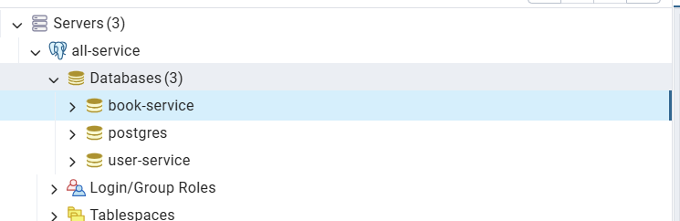

# Spring Boot User API

### Prerequisites

- Java (JDK 17+)
- Gradle
- PostgreSQL/pgAdmin4 or container PostgreSQL/PgAdmin4 by Docker
- IDE (IntelliJ IDEA, Eclipse, hoặc bất kỳ IDE nào hỗ trợ Java)
- Postman or ThunderClient for VSCode

### Start project book-service
- Step 1: Start all container (PostgreSQL, PgAdmin) or tool of them in local
- Step 2: Create a database book-service: 

- Step 3: (If necessary) adjust to the appropriate IDE version in application.properties
- Step 4: Run BookServiceApplication
- Step 5: Test postman or ThunderClient

