# Borrowing Service

### 1 Người đọc gửi yêu cầu mượn sách (POST /api/borrow-requests)
```
    http://localhost:8080/api/borrow-requests
```
#### POSTMAN
###### Thành công
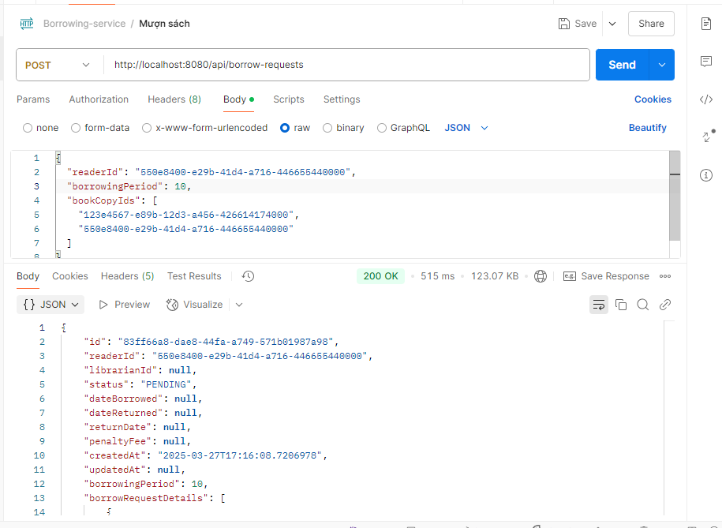
###### Thất bại khi để không có readerId,book,borrowPeriod phải lớn hơn 0
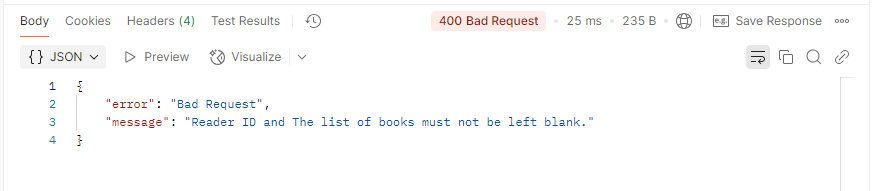

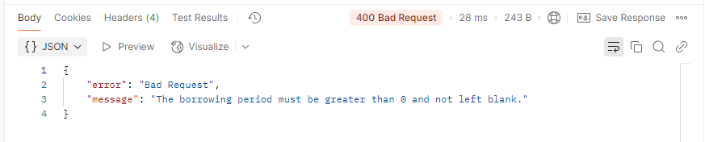

### 2 Thủ thư xác nhận hoặc từ chối yêu cầu mượn sách (PUT /api/borrow-requests/{requestId}/status)
```
http://localhost:8080/api/borrow-requests/{requestId}/status
```
###### Thành công
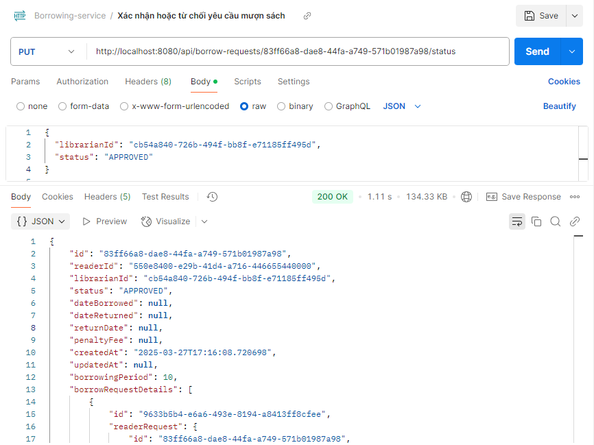
###### Thất bại khi bị sai status,không tìm thấy requestId
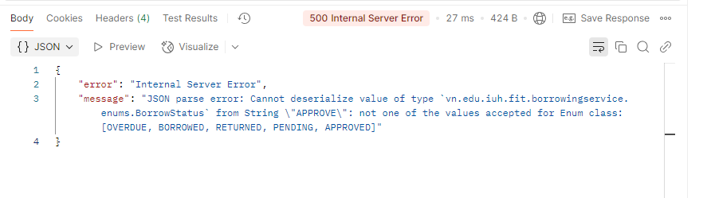
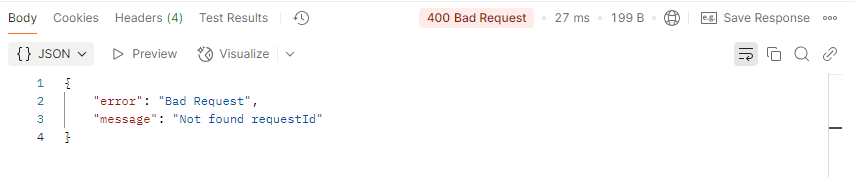

### 3 Cập nhật trạng thái sách khi được mượn (PUT /api/borrow-requests/{requestId}/borrow)
```
http://localhost:8080/api/borrow-requests/{requestId}/borrow
```
###### Thành công
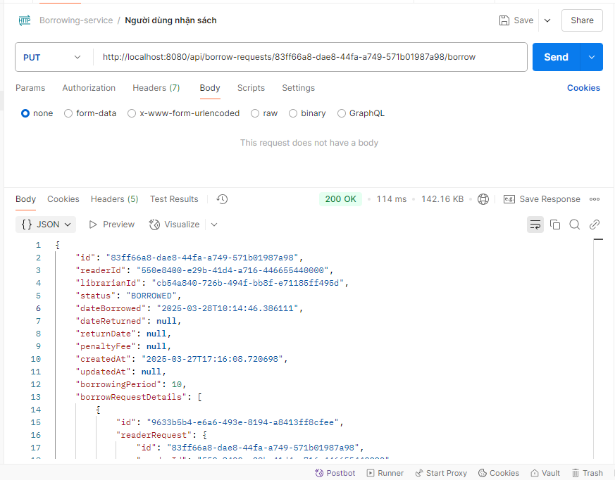
###### Thất bại khi không tìm thấy requestId
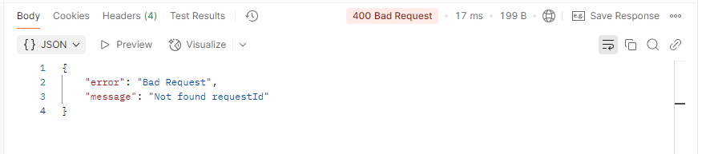

### 4 Cập nhật trạng thái sách khi được trả (PUT /api/borrow-requests/{requestId}/return)
```
http://localhost:8080/api/borrow-requests/{requestId}/return
```
###### Thành công
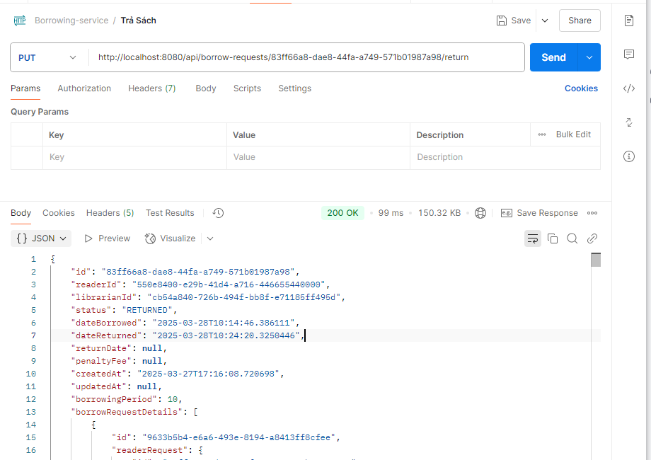
##### Thất bại khi không tìm thấy requestId
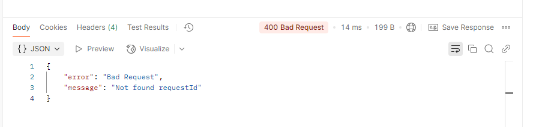
### 5 Tính phí phạt khi sách bị mất/hỏng hoặc trả trễ (PUT /api/borrow-requests/{requestId}/penalty)
```
http://localhost:8080/api/borrow-requests/{requetsId}/penalty
```
###### Thất bại khi requestId sai, request có status không phải OVERDUE,chi phí không hợp lệ
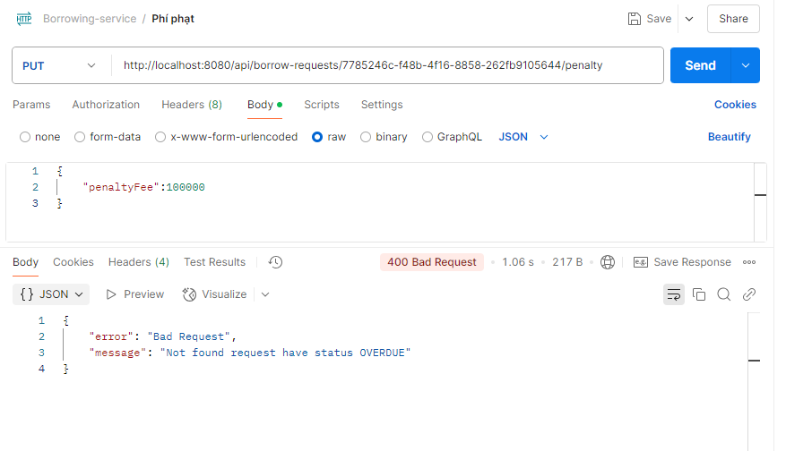   
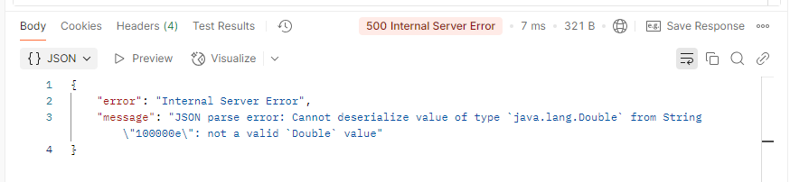

###### Thành công
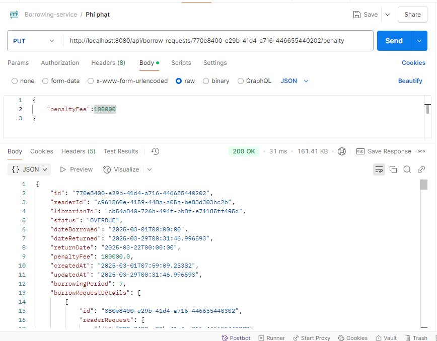

### 6 Người dùng(người đọc) xem danh sách sách đã mượn và trả (GET /api/users/{userId}/borrow-history)
```
http://localhost:8080/api/borrow-requests/users/{readerId}/borrow-history
```
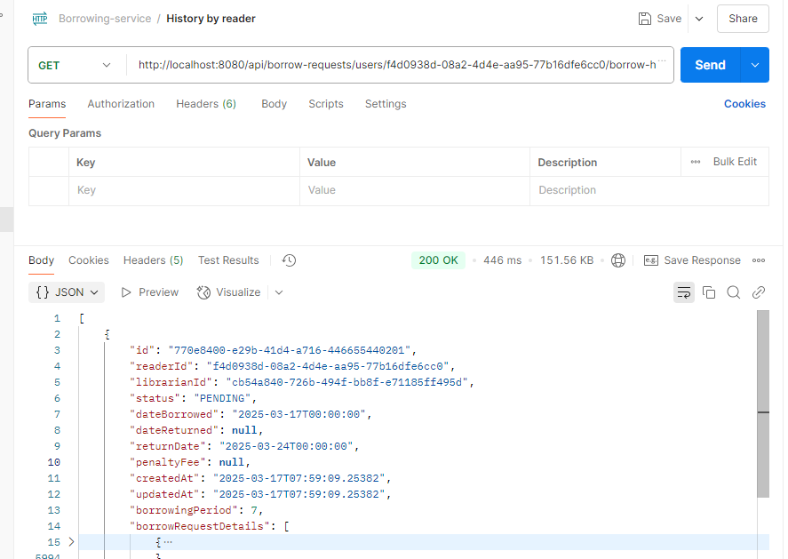
###### Nếu không có thì trả về rỗng
