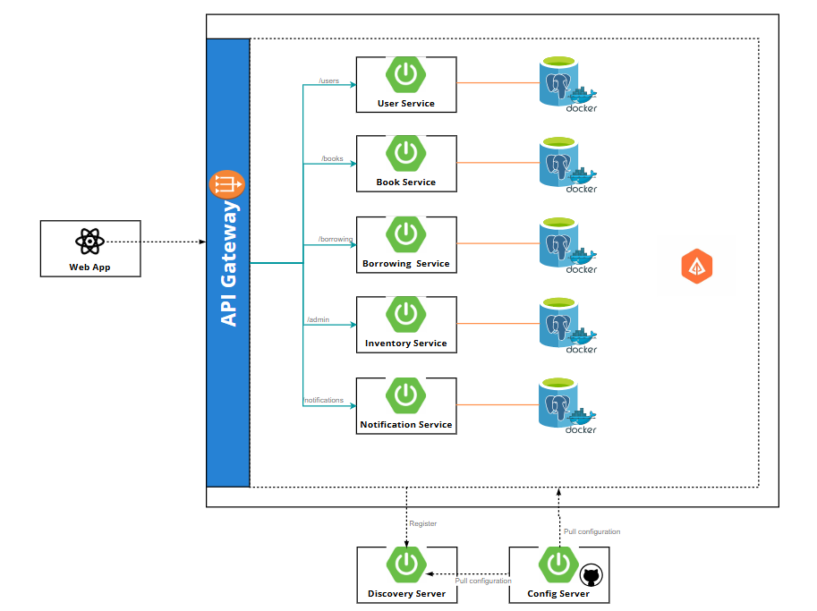

# Thiết Kế Hệ Thống Quản Lý Thư Viện Kết Hợp Microservices Với Spring Boot

Khi bạn chọn kiến trúc **Microservices** cho toàn bộ hệ thống quản lý thư viện và kết hợp với **Spring Boot**, bạn đã định hình một cách thiết kế hệ thống phân tán, linh hoạt và mạnh mẽ. Dưới đây là cách hệ thống được thiết kế dựa trên sự kết hợp này, bao gồm cách **Spring Boot** hỗ trợ **Microservices** và cách các **Architectural Principles**, **Styles**, và **Patterns** được áp dụng.

---

## 1. Tổng Quan Thiết Kế

- **Ý nghĩa của Microservices**: Hệ thống được chia thành các dịch vụ nhỏ, độc lập (Book Service, User Service, Borrowing Service, Notification Service), mỗi dịch vụ chạy riêng biệt và giao tiếp qua API hoặc message queue.
- **Vai trò của Spring Boot**: Spring Boot cung cấp nền tảng để triển khai từng Microservice nhanh chóng, với embedded server, cấu hình tự động, và tích hợp các công cụ như Spring Cloud, Spring Data, Spring Kafka.

**Kết quả**:  
- Mỗi dịch vụ là một ứng dụng Spring Boot riêng, có thể triển khai độc lập trên các máy chủ hoặc container (Docker).
- Hệ thống dễ mở rộng, bảo trì, và tích hợp với các công nghệ khác.

---

## 2. Áp Dụng Architectural Principles, Styles, Patterns

### a. Architectural Principles

- **Separation of Concerns**:  
  - Mỗi dịch vụ chỉ xử lý một chức năng cụ thể (Book Service quản lý sách, User Service quản lý người dùng).  
  - Spring Boot hỗ trợ qua các module riêng biệt (Spring Web cho API, Spring Data cho database).
- **Scalability**:  
  - Microservices cho phép chạy nhiều instance của từng dịch vụ, Spring Boot tích hợp Spring Cloud LoadBalancer để phân tải.  
  - Ví dụ: Borrowing Service có thể scale ngang khi số lượng mượn/trả tăng.
- **Loose Coupling**:  
  - Các dịch vụ giao tiếp qua REST API hoặc Kafka, không phụ thuộc trực tiếp vào nhau.  
  - Spring Boot dùng Dependency Injection để giảm kết nối chặt trong nội bộ dịch vụ.
- **Modularity**:  
  - Mỗi Microservice là một module độc lập, Spring Boot dùng Starters để thêm tính năng (như `spring-boot-starter-kafka` cho Borrowing Service).

### b. Architectural Styles

- **Microservices**:  
  - Toàn bộ hệ thống được thiết kế theo phong cách này, mỗi dịch vụ là một Spring Boot app.  
  - Spring Boot hỗ trợ bằng embedded server (Tomcat) và Spring Cloud (Gateway, Eureka).
- **Event-Driven**:  
  - Borrowing Service và Notification Service giao tiếp qua sự kiện (Kafka).  
  - Spring Boot dùng Spring Kafka để hiện thực hóa phong cách này.
- **Client-Server**:  
  - Web/Mobile App (client) gửi yêu cầu đến API Gateway (server), Spring Boot cung cấp REST API qua Spring Web.
- **Layered**:  
  - Trong từng dịch vụ, Spring Boot tổ chức theo tầng: Controller (API), Service (logic), Repository (data).

### c. Architectural Patterns

- **CQRS**:  
  - Trong Book Service, Spring Data JPA tách biệt lệnh (thêm sách) và truy vấn (tìm sách).  
- **Event Sourcing**:  
  - Borrowing Service dùng Spring Data MongoDB để lưu sự kiện mượn/trả.  
- **Publish-Subscribe**:  
  - Spring Kafka trong Borrowing Service gửi sự kiện, Notification Service lắng nghe qua `@KafkaListener`.  
- **MVC**:  
  - Spring MVC trong mỗi dịch vụ (Controller trả JSON thay vì View truyền thống).  
- **Repository**:  
  - Spring Data cung cấp `JpaRepository` (Book, User) và `MongoRepository` (Borrowing).

---

## 3. Cấu Trúc Hệ Thống Tổng Quát

### a. Các Thành Phần Chính

1. **API Gateway**:
   - Spring Boot app dùng **Spring Cloud Gateway**.
   - Định tuyến yêu cầu từ Web/Mobile App đến các dịch vụ (Book, User, Borrowing).
   - Ví dụ: `/api/books` --> Book Service.

2. **Book Service**:
   - Spring Boot app với **Spring Web** và **Spring Data JPA**.
   - Quản lý sách, lưu vào PostgreSQL.
   - REST API: `POST /api/books`, `GET /api/books/search`.

3. **User Service**:
   - Spring Boot app với **Spring Web**, **Spring Security**, **Spring Data JPA**.
   - Quản lý người dùng, lưu vào PostgreSQL.
   - REST API: `POST /api/users`.

4. **Borrowing Service**:
   - Spring Boot app với **Spring Web**, **Spring Kafka**, **Spring Data MongoDB**.
   - Quản lý mượn/trả, lưu sự kiện vào MongoDB, gửi qua Kafka.
   - REST API: `POST /api/borrowing/borrow`.

5. **Notification Service**:
   - Spring Boot app với **Spring Kafka**.
   - Lắng nghe sự kiện từ Kafka, gửi thông báo (SMS/email).
   - Không có REST API trực tiếp.

6. **Web/Mobile App**:
   - Client (không phải Spring Boot), giao tiếp với API Gateway qua HTTP.

### b. Cơ Sở Hạ Tầng Hỗ Trợ

- **Service Discovery**: Spring Cloud Netflix Eureka để các dịch vụ tìm nhau.
- **Message Queue**: Kafka để truyền sự kiện từ Borrowing Service đến Notification Service.
- **Database**: PostgreSQL (Book, User), MongoDB (Borrowing).
- **Load Balancing**: Spring Cloud LoadBalancer để phân tải nếu có nhiều instance.

### c. Sơ Đồ Kiến Trúc

---

## 4. Cách Spring Boot Hỗ Trợ Microservices

### a. Triển Khai Độc Lập
- Mỗi dịch vụ là một Spring Boot app với embedded Tomcat, chạy trên port riêng (ví dụ: Book Service trên 8081, User Service trên 8082).
- Có thể đóng gói thành JAR hoặc Docker container.

### b. Giao Tiếp Giữa Các Dịch Vụ
- **REST API**: Spring Web cung cấp `@RestController` để giao tiếp đồng bộ (ví dụ: Web App gọi Book Service).
- **Kafka**: Spring Kafka hỗ trợ giao tiếp bất đồng bộ (Borrowing --> Notification).

### c. Quản Lý Cấu Hình
- **Spring Boot Properties/YAML**: Mỗi dịch vụ có `application.yml` riêng (database URL, Kafka broker).
- **Spring Cloud Config** (tùy chọn): Quản lý tập trung cấu hình qua Git.

### d. Khám Phá Dịch Vụ
- **Spring Cloud Eureka**: Các dịch vụ đăng ký với Eureka Server, API Gateway dùng Eureka Client để tìm dịch vụ.

### e. Bảo Mật
- **Spring Security**: Dùng JWT hoặc OAuth2 để xác thực yêu cầu giữa Web App và các dịch vụ.

### f. Giám Sát
- **Spring Boot Actuator**: Theo dõi sức khỏe từng dịch vụ (`/actuator/health`).
---

## 5. Tổng Kết Thiết Kế
Khi chọn Microservices kết hợp Spring Boot:

- Hệ thống được thiết kế phân tán: Mỗi dịch vụ là một Spring Boot app độc lập, giao tiếp qua REST hoặc Kafka.
- Principles được đảm bảo: Scalability (Spring Cloud), Loose Coupling (Kafka, DI), Modularity (Starters).
- Styles được hiện thực: Microservices (Spring Boot app), Event-Driven (Spring Kafka), Layered (Controller-Service-Repository).
- Patterns được áp dụng: CQRS (Spring Data), Event Sourcing (MongoDB), MVC (Spring Web).
Hệ thống này linh hoạt, dễ mở rộng (thêm dịch vụ mới như Reservation Service), và tận dụng tối đa sức mạnh của Spring Boot trong môi trường Microservices.

