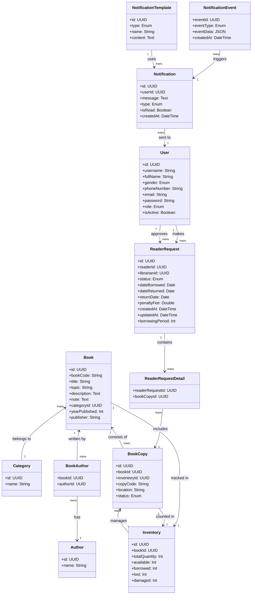

**1. User Service:** Quản lý thông tin người dùng.

- Bảng: User
- Cơ sở dữ liệu: user_service_db

**2. Book Service:** Quản lý thông tin sách, thể loại và tác giả.

- Bảng: Book, Category, Author, BookAuthor
- Cơ sở dữ liệu: book_service_db

**3. Borrowing Service:** Quản lý các yêu cầu mượn sách của độc giả.

- Bảng: ReaderRequest, ReaderRequestDetail
- Cơ sở dữ liệu: borrowing_service_db

**4. Inventory Service:** Quản lý thông tin về các bản sao sách và tình trạng kho.

- Bảng: BookCopy, Inventory
- Cơ sở dữ liệu: inventory_service_db

**5. Notification Service:** Quản lý các sự kiện và thông báo gửi đến người dùng.

- Bảng: NotificationEvent, Notification, NotificationTemplate
- Cơ sở dữ liệu: notification_service_db
