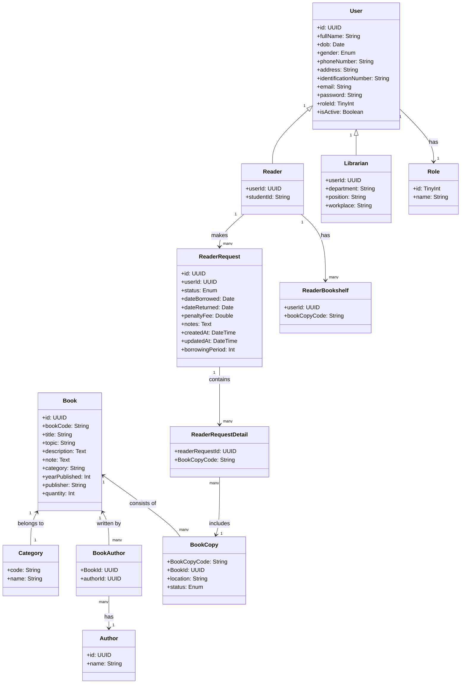

```mermaid
classDiagram
    class User {
        +id: UUID
        +fullName: String
        +dob: Date
        +gender: Enum
        +phoneNumber: String
        +address: String
        +identificationNumber: String
        +email: String
        +password: String
        +roleId: TinyInt
        +isActive: Boolean
    }

    class Role {
        +id: TinyInt
        +name: String
    }

    class Librarian {
        +userId: UUID
        +department: String
        +position: String
        +workplace: String
    }

    class Reader {
        +userId: UUID
        +studentId: String
    }

    class ReaderBookshelf {
        +userId: UUID
        +bookCopyCode: String
    }

    class Book {
        +id: UUID
        +bookCode: String
        +title: String
        +topic: String
        +description: Text
        +note: Text
        +category: String
        +yearPublished: Int
        +publisher: String
        +quantity: Int
    }

    class Category {
        +code: String
        +name: String
    }

    class BookCopy {
        +BookCopyCode: String
        +BookId: UUID
        +location: String
        +status: Enum
    }

    class ReaderRequest {
        +id: UUID
        +userId: UUID
        +status: Enum
        +dateBorrowed: Date
        +dateReturned: Date
        +penaltyFee: Double
        +notes: Text
        +createdAt: DateTime
        +updatedAt: DateTime
        +borrowingPeriod: Int
    }

    class ReaderRequestDetail {
        +readerRequestId: UUID
        +BookCopyCode: String
    }

    class Author {
        +id: UUID
        +name: String
    }

    class BookAuthor {
        +BookId: UUID
        +authorId: UUID
    }

    %% Quan hệ sau khi bỏ ReaderCard
    User "1" --> "1" Role : has
    User "1" <|-- Librarian
    User "1" <|-- Reader

    Reader "1" --> "many" ReaderBookshelf : has
    Reader "1" --> "many" ReaderRequest : makes
    ReaderRequest "1" --> "many" ReaderRequestDetail : contains
    ReaderRequestDetail "many" --> "1" BookCopy : includes
    Book "1" <-- "many" BookCopy : consists of
    Book "1" <-- "many" BookAuthor : written by
    BookAuthor "many" --> "1" Author : has
    Book "1" <-- "1" Category : belongs to
```