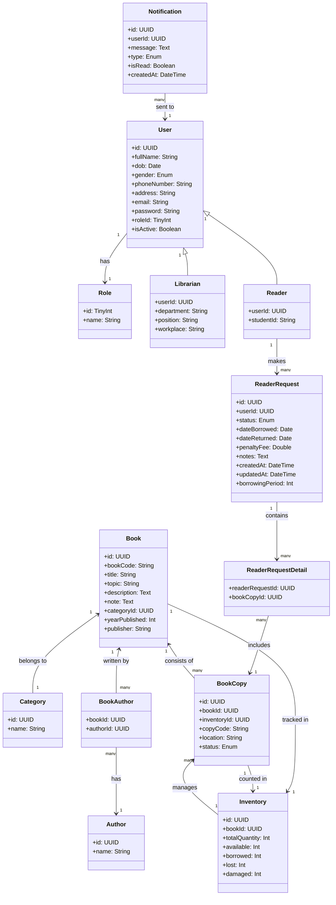

**1️⃣ User Service**

- User: Chứa thông tin người dùng.

- Role: Xác định vai trò của người dùng (Admin, Reader, Librarian,...).

- Librarian: Người quản lý thư viện (mở rộng từ User).

- Reader: Độc giả thư viện (mở rộng từ User).

**2️⃣ Book Service**

- Book: Chứa thông tin sách.

- Category: Thể loại sách.

- Author: Tác giả sách.

- BookAuthor: Liên kết giữa sách và tác giả.

**3️⃣ Borrowing Service**

- ReaderRequest: Đơn mượn/trả sách.

- ReaderRequestDetail: Danh sách các bản sao sách trong đơn mượn.

**4️⃣ Inventory Service**

- BookCopy: Quản lý từng bản sao của sách (định danh bằng copyCode).

- Inventory: Theo dõi tổng số lượng sách, số lượng sách có sẵn, bị mất hoặc hỏng.

**5️⃣ Notification Service**

- Notification: Gửi thông báo cho người dùng về các sự kiện quan trọng.

