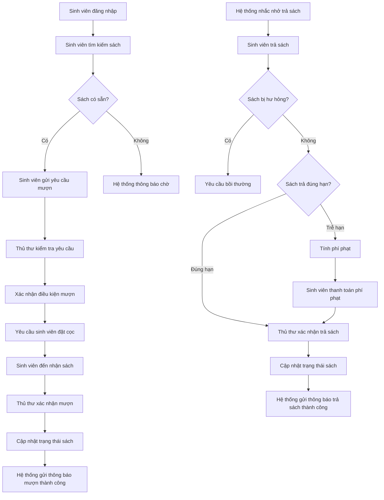

```mermaid
graph TD;
    %% Luồng mượn sách

    A[Sinh viên đăng nhập] --> B[Sinh viên tìm kiếm sách]
    B --> C{Sách có sẵn?}
    C -- Có --> D[Sinh viên gửi yêu cầu mượn]
    C -- Không --> E[Hệ thống thông báo chờ]

    D --> F[Thủ thư kiểm tra yêu cầu]
    F --> G[Xác nhận điều kiện mượn]
    G --> H[Yêu cầu sinh viên đặt cọc]
    H --> I[Sinh viên đến nhận sách]
    I --> J[Thủ thư xác nhận mượn]
    J --> K[Cập nhật trạng thái sách]
    K --> L[Hệ thống gửi thông báo mượn thành công]

    %% Luồng trả sách
    
    M[Hệ thống nhắc nhở trả sách] --> N[Sinh viên trả sách]
    N --> O{Sách bị hư hỏng?}
    O -- Có --> P[Yêu cầu bồi thường]
    O -- Không --> Q{Sách trả đúng hạn?}

    Q -- Trễ hạn --> R[Tính phí phạt]
    Q -- Đúng hạn --> S[Thủ thư xác nhận trả sách]
    R --> T[Sinh viên thanh toán phí phạt]
    T --> S

    S --> U[Cập nhật trạng thái sách]
    U --> V[Hệ thống gửi thông báo trả sách thành công]
```