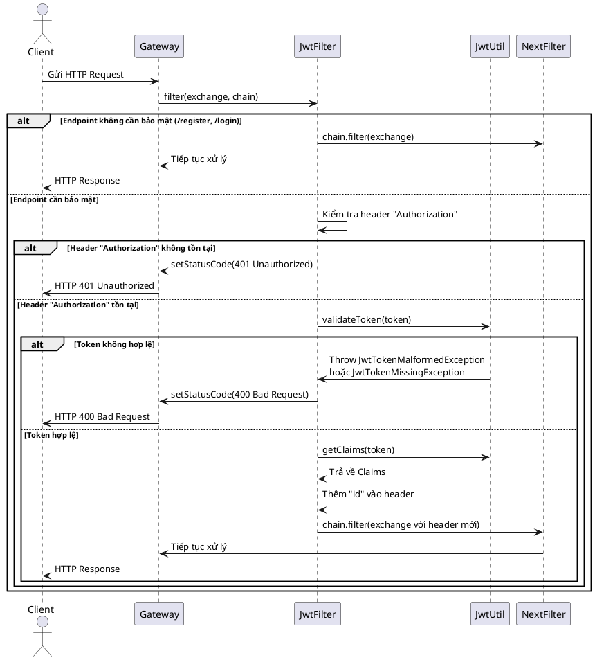
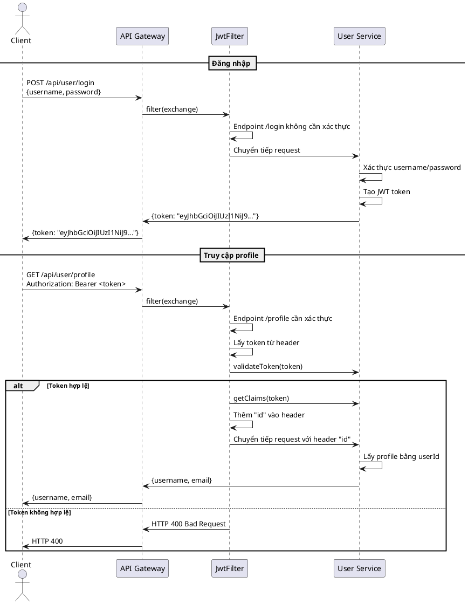
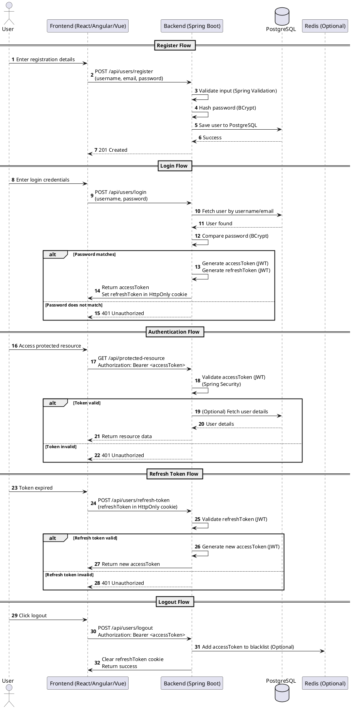
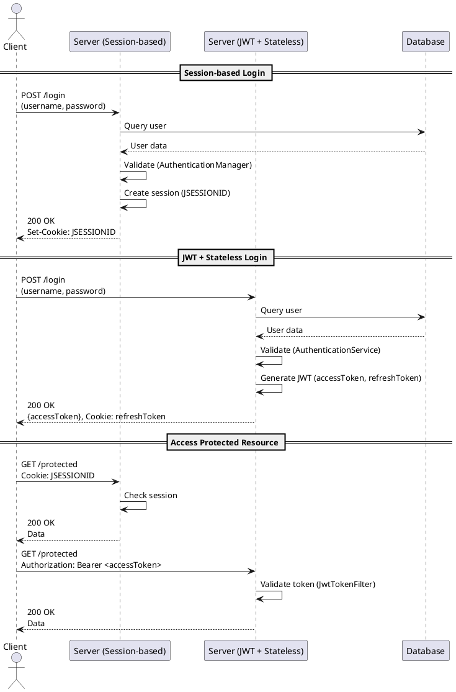
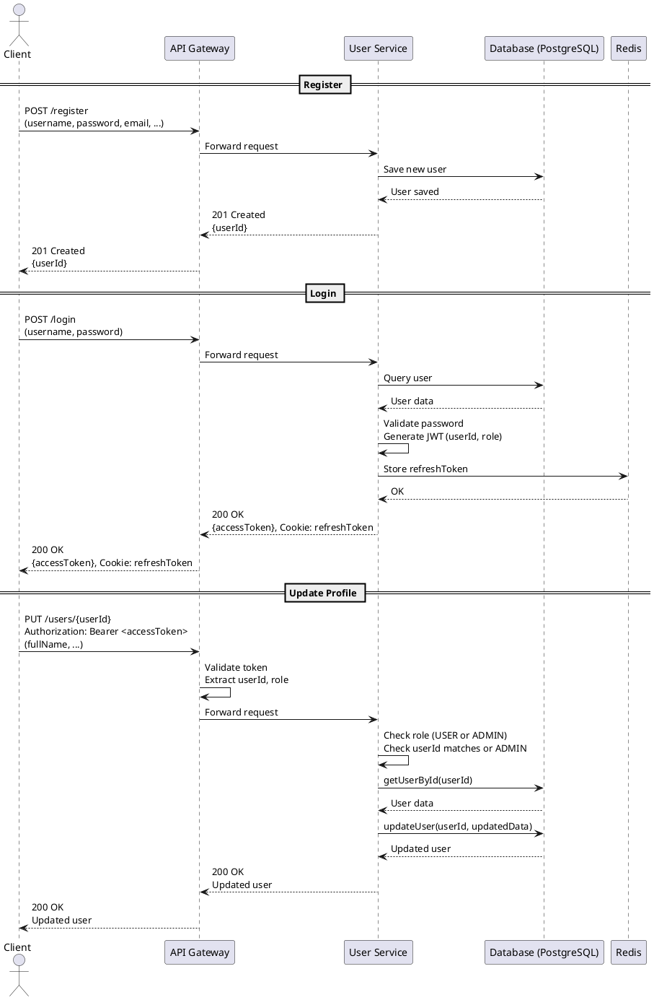
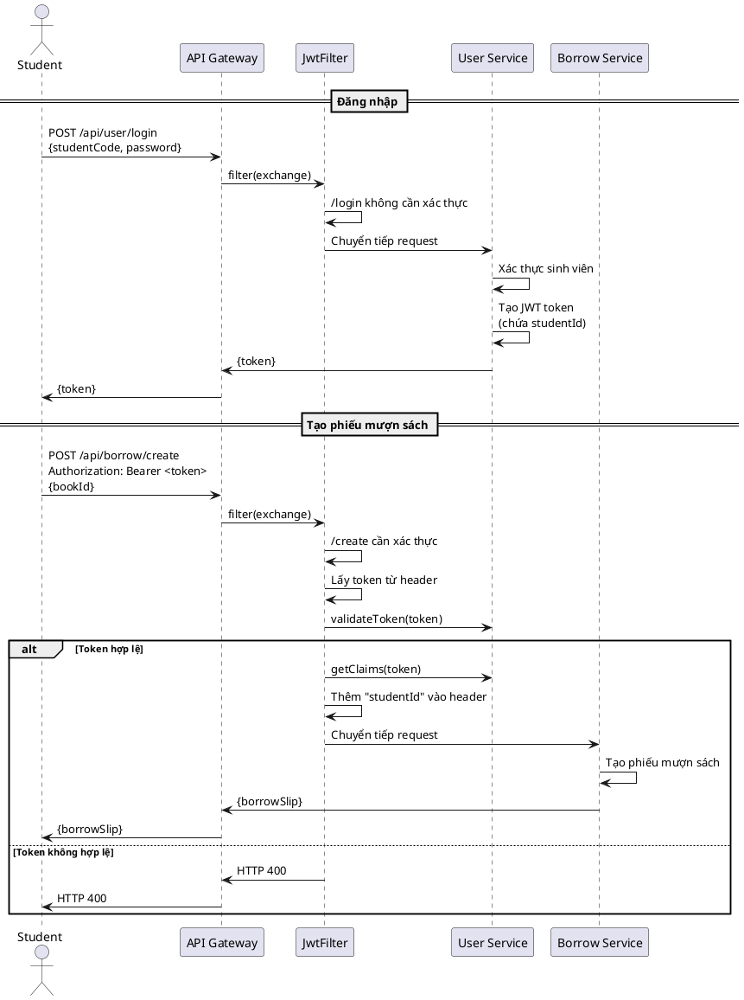

## 1. JWT processing process in Spring Cloud Gateway

**1. `Client` gửi request:** `Client` gửi một HTTP request tới `Gateway` (Spring Cloud Gateway).

**2. `Gateway` gọi `JwtFilter`:** Gateway áp dụng `JwtAuthenticationFilter` bằng cách gọi phương thức `filter(exchange, chain)`.

**3. Kiểm tra endpoint:**
- Nếu endpoint không cần bảo mật (ví dụ: /register, /login), `JwtFilter` gọi `chain.filter(exchange)` để chuyển tiếp request tới `NextFilter`.
- Nếu endpoint cần bảo mật, `JwtFilter` kiểm tra header `Authorization`.

**4. Xử lý header Authorization:**
- Nếu header không tồn tại, `JwtFilter` trả về mã trạng thái 401 Unauthorized thông qua `Gateway`.
- Nếu header tồn tại, `JwtFilter` gọi `JwtUtil.validateToken(token)` để kiểm tra tính hợp lệ của token.

**5. Xác thực token:**
- Nếu token không hợp lệ, `JwtUtil` ném ngoại lệ, và `JwtFilter` trả về mã trạng thái 400 Bad Request.
- Nếu token hợp lệ, `JwtFilter` gọi `JwtUtil.getClaims(token)` để lấy thông tin `Claims`, thêm id vào header, rồi chuyển tiếp request tới `NextFilter`.

**6. Hoàn tất xử lý:** `NextFilter` tiếp tục xử lý request, và `Gateway` trả về response cho `Client`.

## 2. JWT processing process in Spring Cloud Gateway and User Service

## 3. Register, Authentication, Login, Logout

### Flow compares Session-based (default Spring Security) and JWT + Stateless

### Stream with authentication and authorization

## 4. Student create a book borrowing request

