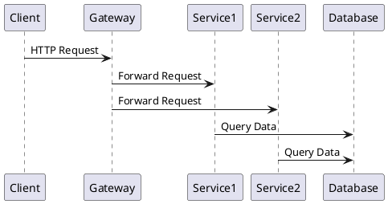
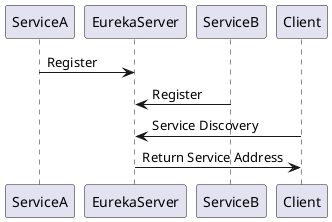
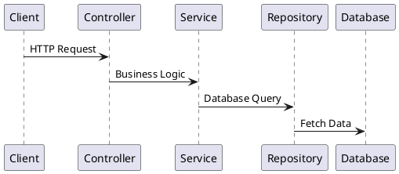
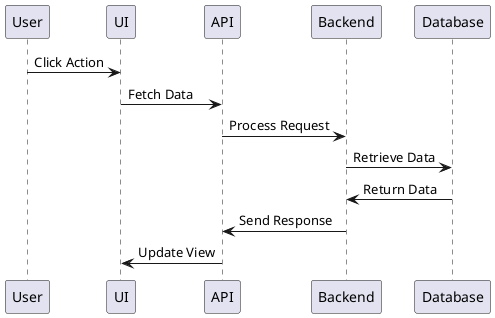
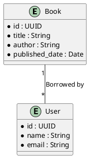
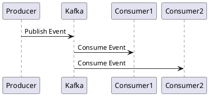
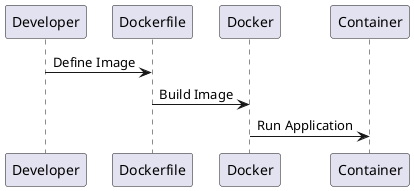

# Tech Stack - Library Management System (Microservices & Spring)

## 1. Kiến trúc hệ thống
- **Microservices Architecture**: 
  - Mỗi chức năng chính của hệ thống (quản lý sách, quản lý người dùng, quản lý mượn trả,...) được triển khai thành một microservice riêng biệt.
  - Giúp hệ thống dễ dàng mở rộng, bảo trì và triển khai độc lập từng service.
  - Các microservices có thể giao tiếp với nhau thông qua HTTP REST API hoặc message queue.
  - 📖 [Microservices Architecture Guide](https://microservices.io/)

- **API Gateway**: 
  - Sử dụng **Spring Cloud Gateway** để cung cấp một điểm truy cập duy nhất cho toàn bộ hệ thống.
  - Giúp điều hướng request đến các microservices phù hợp và hỗ trợ cân bằng tải.
  - Có thể áp dụng xác thực, logging, caching để tăng hiệu suất.
  - 📖 [Spring Cloud Gateway Documentation](https://docs.spring.io/spring-cloud-gateway/docs/current/reference/html/)

- **Service Discovery**:
  - Dùng **Eureka Server** để giúp các microservices tự động đăng ký và tìm kiếm lẫn nhau.
  - Tránh tình trạng hardcode địa chỉ của các microservices, giúp hệ thống linh động hơn.
  - 📖 [Spring Cloud Eureka Guide](https://cloud.spring.io/spring-cloud-netflix/reference/html/)

## 2. Công nghệ backend
- **Spring Boot**:
  - Framework giúp đơn giản hóa việc phát triển ứng dụng backend.
  - Cung cấp cấu hình tự động, giúp lập trình viên tập trung vào logic chính của hệ thống.
  - 📖 [Spring Boot Documentation](https://docs.spring.io/spring-boot/docs/current/reference/html/)

## 3. Công nghệ frontend
- **React.js hoặc Angular**:
  - React.js: Hỗ trợ xây dựng giao diện động, dễ bảo trì.
  - Angular: Framework mạnh mẽ với nhiều công cụ hỗ trợ sẵn có.
  - 📖 [React Documentation](https://reactjs.org/docs/getting-started.html)
  - 📖 [Angular Documentation](https://angular.io/docs)

## 4. Cơ sở dữ liệu
- **PostgreSQL / MySQL / MariaDB**:
  - Lưu trữ thông tin sách, người dùng, lịch sử mượn trả.
  - 📖 [PostgreSQL Documentation](https://www.postgresql.org/docs/)
  - 📖 [MySQL Documentation](https://dev.mysql.com/doc/)

## 5. Hệ thống message queue
- **Apache Kafka**:
  - Giao tiếp giữa các microservices theo mô hình publish-subscribe.
  - 📖 [Kafka Documentation](https://kafka.apache.org/documentation/)

## 6. Công cụ DevOps & CI/CD
- **Docker**:
  - Container hóa từng microservice, giúp triển khai dễ dàng.
  - 📖 [Docker Documentation](https://docs.docker.com/)

---
### Tổng kết
Hệ thống quản lý thư viện sử dụng kiến trúc microservice kết hợp Spring Boot và Spring Cloud để đảm bảo khả năng mở rộng và linh hoạt. Các công nghệ hỗ trợ giúp nâng cao hiệu suất, bảo mật và khả năng bảo trì hệ thống. Mỗi công nghệ đều có vai trò quan trọng và được chọn để tối ưu hóa từng phần của hệ thống.

