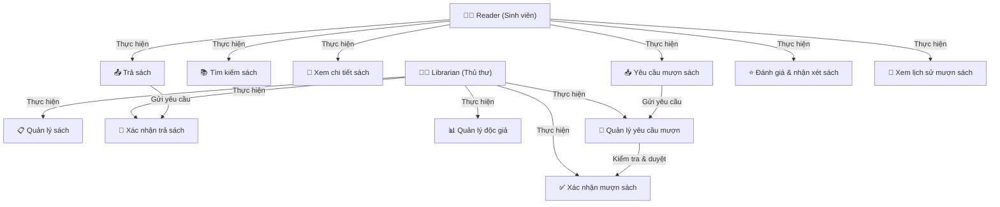

```mermaid
%% Use Case Diagram cho hệ thống thư viện
graph TD
    %% Actors
    Reader["🧑‍🎓 Reader (Sinh viên)"]
    Librarian["👩‍💼 Librarian (Thủ thư)"]

    %% Use Cases cho Reader
    UC1["📚 Tìm kiếm sách"]
    UC2["📖 Xem chi tiết sách"]
    UC3["📥 Yêu cầu mượn sách"]
    UC4["📤 Trả sách"]
    UC5["⭐ Đánh giá & nhận xét sách"]
    UC6["📝 Xem lịch sử mượn sách"]

    %% Use Cases cho Librarian
    UC7["📋 Quản lý sách"]
    UC8["✅ Xác nhận mượn sách"]
    UC9["🚀 Xác nhận trả sách"]
    UC10["📊 Quản lý độc giả"]
    UC11["📜 Quản lý yêu cầu mượn"]

    %% Kết nối Actors với Use Cases
    Reader -->|Thực hiện| UC1
    Reader -->|Thực hiện| UC2
    Reader -->|Thực hiện| UC3
    Reader -->|Thực hiện| UC4
    Reader -->|Thực hiện| UC5
    Reader -->|Thực hiện| UC6

    Librarian -->|Thực hiện| UC7
    Librarian -->|Thực hiện| UC8
    Librarian -->|Thực hiện| UC9
    Librarian -->|Thực hiện| UC10
    Librarian -->|Thực hiện| UC11

    %% Quan hệ giữa các Use Cases
    UC3 -->|Gửi yêu cầu| UC11
    UC4 -->|Gửi yêu cầu| UC9
    UC11 -->|Kiểm tra & duyệt| UC8
```