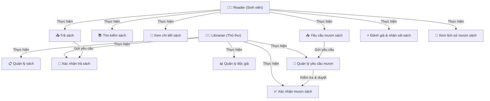

**1. User Service**

- UC-01: Đăng ký tài khoản
- UC-02: Đăng nhập
- UC-03: Cập nhật thông tin cá nhân
- UC-04: Thay đổi mật khẩu
- UC-05: Quản lý vai trò người dùng
- UC-06: Kích hoạt/Vô hiệu hóa tài khoản

**2. Book Service**

- UC-07: Thêm sách mới
- UC-08: Cập nhật thông tin sách
- UC-09: Xóa sách
- UC-10: Tìm kiếm sách
- UC-11: Quản lý danh mục sách
- UC-12: Thêm tác giả cho sách

**3. Borrowing Service**

- UC-13: Yêu cầu mượn sách
- UC-14: Phê duyệt yêu cầu mượn sách
- UC-15: Ghi nhận sách đã mượn
- UC-16: Ghi nhận sách đã trả
- UC-17: Xử lý phí phạt
- UC-18: Gia hạn thời gian mượn
- UC-19: Xem lịch sử mượn/trả sách

**4. Inventory Service**

- UC-20: Thêm bản sao sách vào kho
- UC-21: Cập nhật thông tin bản sao sách
- UC-22: Kiểm tra số lượng sách
- UC-23: Ghi nhận sách bị mất/hỏng
- UC-24: Xem báo cáo tổng số lượng sáchs

**5. Notification Service**

- UC-25: Gửi thông báo quá hạn trả sách
- UC-26: Gửi thông báo mượn sách
- UC-27: Gửi thông báo sách mới
- UC-28: Xem danh sách thông báo
- UC-29: Đánh dấu thông báo đã đọc
- UC-30: Gửi email nhắc nhở hạn trả sách

