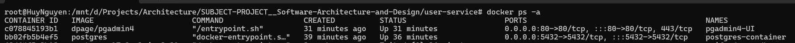

# Spring Boot User API

### Prerequisites

- Java (JDK 17+)
- Gradle
- PostgreSQL/pgAdmin4 or container PostgreSQL/PgAdmin4 by Docker
- IDE (IntelliJ IDEA, Eclipse, hoặc bất kỳ IDE nào hỗ trợ Java)
- Postman or ThunderClient for VSCode

### PostgreSQL for docker
- Step 1: Run container PostgreSQL by command:
```bash
docker run --name postgres-container -e POSTGRES_USER=root -e POSTGRES_PASSWORD=root -e POSTGRES_DB=userdb -p 5432:5432 -d postgres
```
- Step 2: Run container for UI pgAdmin4 by command:
```bash
docker run -p 80:80 \
    -e 'PGADMIN_DEFAULT_EMAIL=your@email.com' \
    -e 'PGADMIN_DEFAULT_PASSWORD=yourpassword' \
    --name pgadmin4-UI \
    -d dpage/pgadmin4
```
- Acceptable results:

- Step 3: Access the path: Localhost:80 or Localhost and login with auth of UI pgAdmin4 before:

- Step 4: Register server for UI: 

- Step 5: Enter Name

- Step 6: Enter username and password are 'root'

- Step 7: Value of Host name/address is IPAddress of pgadmin4-UI in Docker
- Enter this command to see PAddress of pgadmin4-UI:
```bash
docker inspect pgadmin4-UI
```
- Result and save:  

### Start project user-service
- Step 1: Create empty table users on pgAdmin4 
- Step 2: Start project user-service
- Step 3: Test postman or ThunderClient