# Spring Boot User API

### Prerequisites

- Java (JDK 17+)
- Gradle
- PostgreSQL/pgAdmin4 or container PostgreSQL/PgAdmin4 by Docker
- IDE (IntelliJ IDEA, Eclipse, hoặc bất kỳ IDE nào hỗ trợ Java)
- Postman or ThunderClient for VSCode
- Redis

### PostgreSQL for docker
- Step 1: Run container PostgreSQL by command:
```bash
docker-compose up -d
```
- Acceptable results:
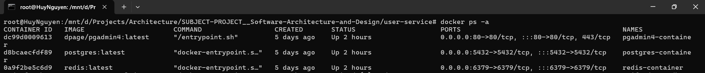
- Step 2: Access the path: Localhost:80 or Localhost and login with auth of UI pgAdmin4 before:
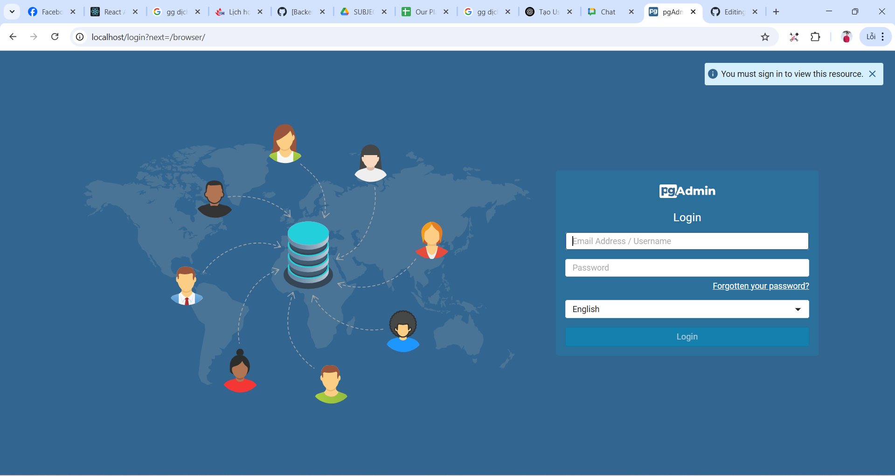
- Step 3: Register server for UI: 
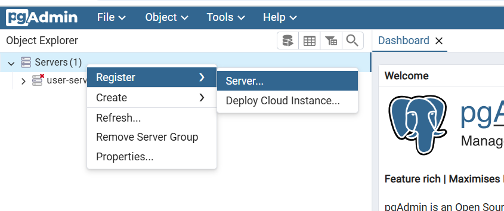
- Step 4: Enter Name
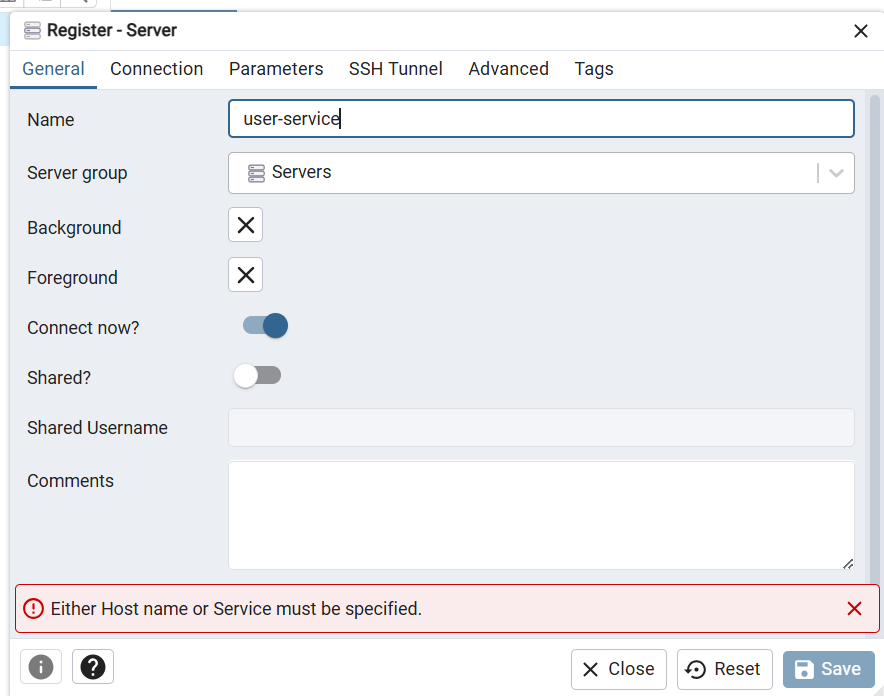
- Step 5: Enter username and password are 'root'
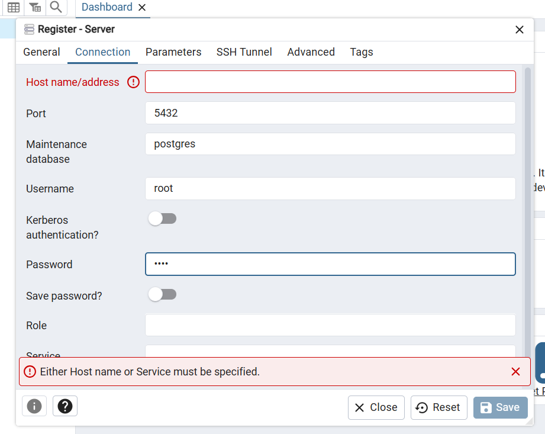
- Step 6: Value of Host name/address is IPAddress of postgres-container in Docker. Enter this command to see IPAddress of postgres-container:
```bash
docker inspect postgres-container
```
- Result and save: 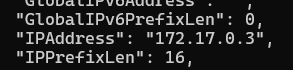 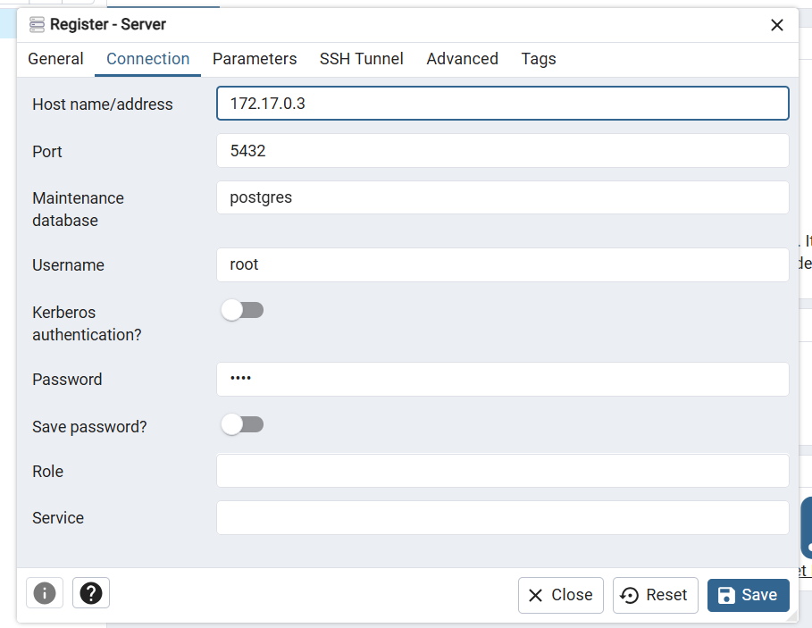
- Step 7: Open console redis by command:
```bash
redis-cli
```
- Result:
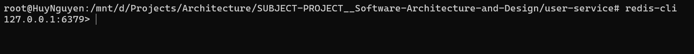
### Start project user-service
- Step 1: (If any) Create empty table users in DB user-service
- Step 2: Start project user-service
- Step 3: Test postman or ThunderClient

***Dinh Nguyen Chung***

**Register:**
```angular2html
http://localhost:8080/api/users/register
```
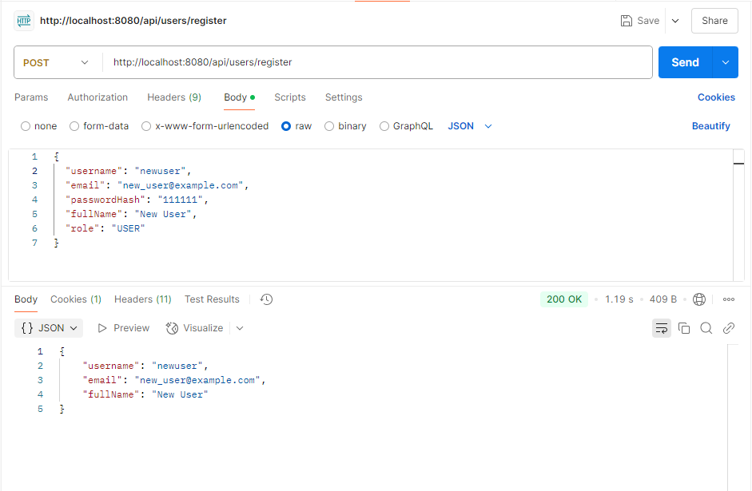
#### Register Thất bại  (trùng userName)
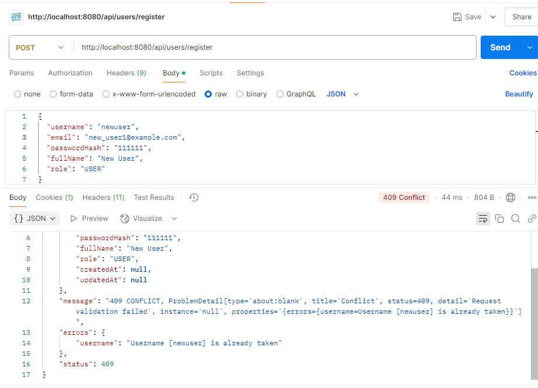
**Login**
```angular2html
http://localhost:8080/api/users/login
```
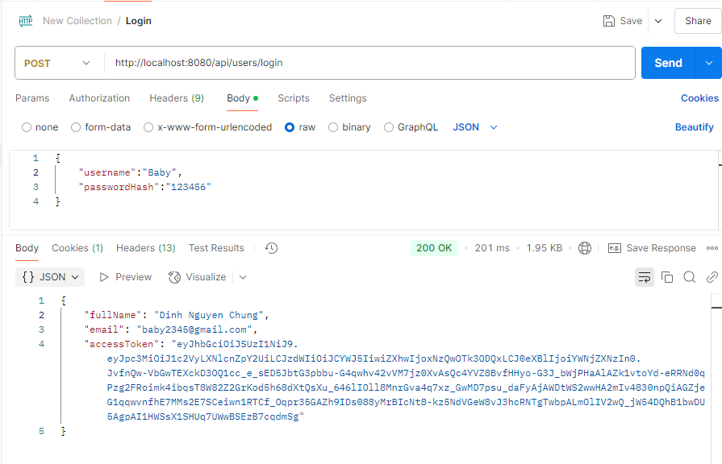
Thành công Login sẽ trả về accessToken và accessToken có time là 30', refreshToken có thời gian 7 ngày được lưu trên cookies.

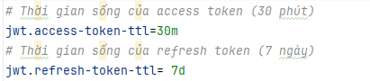

Login thất bại 

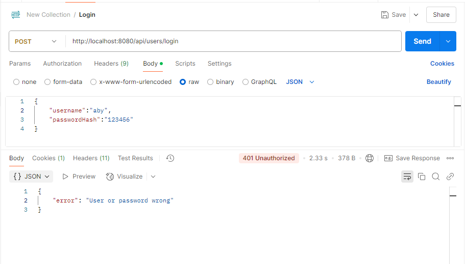

### Khi thực hiện thực hiện refreshToken 


Chọn phương thức POST.

Nhập URL:
```angular2html
http://localhost:8080/api/users/refresh-token
```
Sẽ tự lấy refreshToken trên cookies để lấy access Token mới
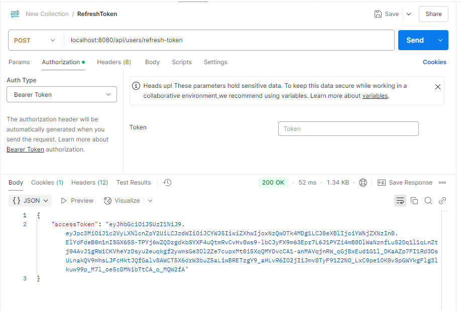

### Kiểm tra tính hợp lệ của access token mới va Get User

Lưu lại accessToken mới từ response (nếu đã refreshToken ) để thực hiện

Method: GET

URL: 
```
http://localhost:8080/api/users/profile/{userId}
```

Thay {userId} 

Header:

Authorization: Bearer new_access_token

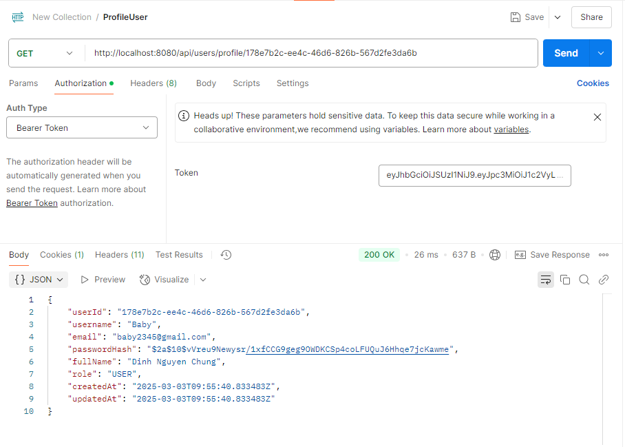


### Logout
Method : POST

URL:
```angular2html
http://localhost:8080/api/users/logout
```

Lấy accessToken gửi vào Beer Token

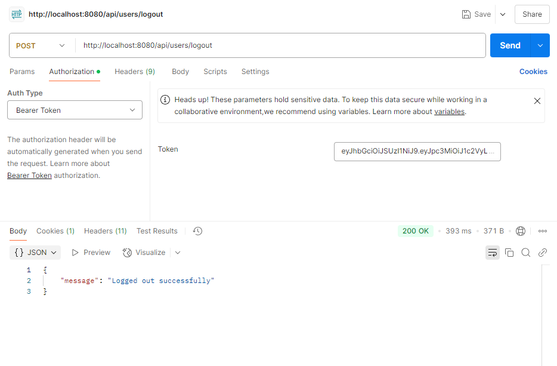

### Kiểm tra accessToken ()
```
http://localhost:8080/api/users/protected-api
```

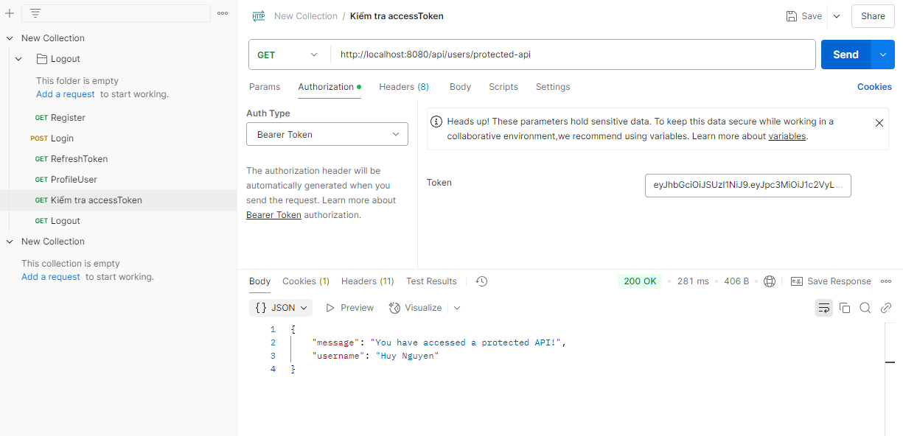

Logout Thành công

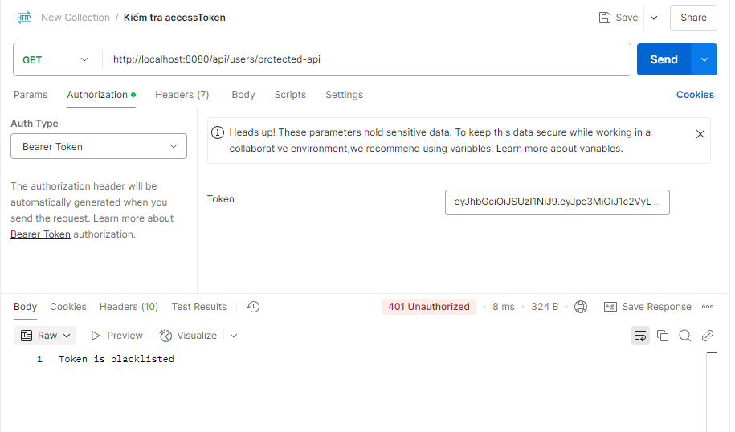

### Update User check token

PUT

```
http://localhost:8080/api/users/{Id}
```

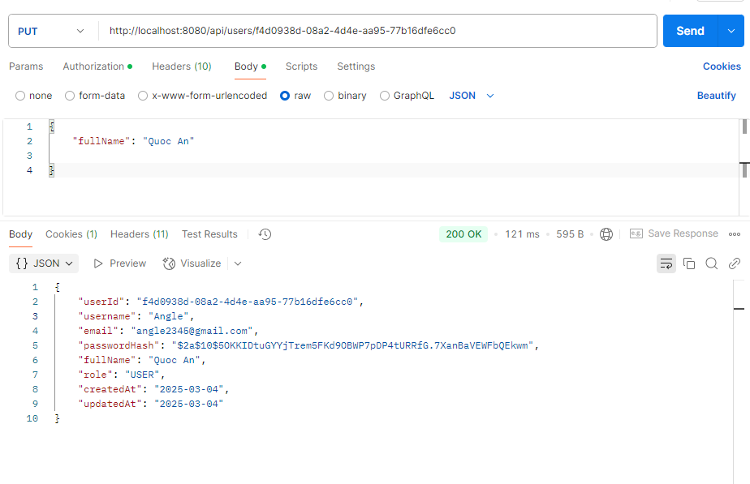

Thieu hoac sai Token 

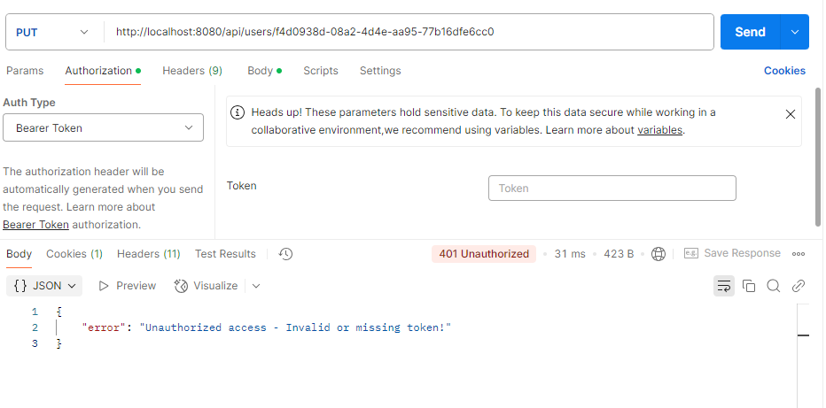